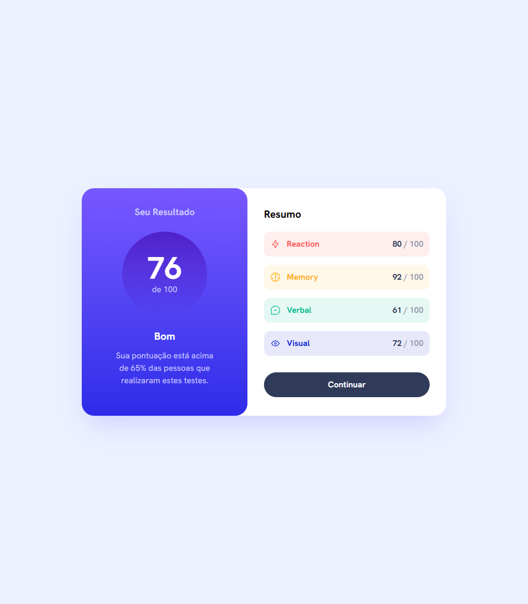
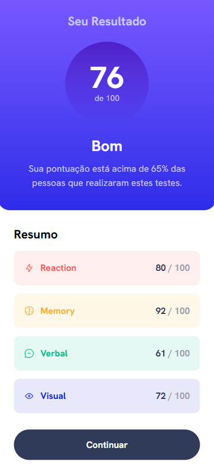

# Frontend Mentor - Results summary component

Esta é uma solução para o [Desafio Results summary component do Frontend Mentor](https://www.frontendmentor.io/challenges/results-summary-component-CE_K6s0maV). 

## Overview

### O Desafio

O usuário pode: 

- Visualizar um layout a depender do tamanho da tela do dispositivo
- Visualizar um efeito ao interagir com o botão 

### Screenshot

## Meu Processo

### Desenvolvido com

- [React](https://react.dev/)
- [Vite](https://vite.dev/)
- [Tailwind CSS](https://tailwindcss.com/)
